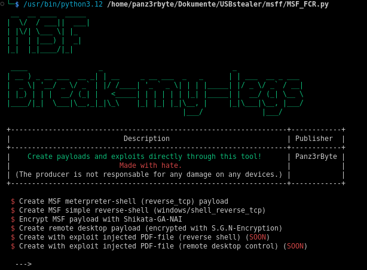

# MSF-Break-My-Legs


> A powerful Python-based tool for crafting **(expl)** and **(payl)** using **Metasploit**.

## 🚀 Features
- 🔥 Automated (expl) generation
- 🎯 Customizable (payl) creation
- ⚡ Seamless integration with **Metasploit Framework**
- 🛠 User-friendly CLI with interactive options
- 📊 Logging and report generation

## 🛠 Installation
Ensure you have **Metasploit Framework** and Python 3 installed before proceeding.

```bash
# Clone the repository
git clone https://github.com/colleBLOXK83/MSF--Break-My-Legs.git
cd msff

# Install dependencies
pip install -r requirements.txt
```

## 🎬 Usage
Launch the tool with the following command:

```bash
python3 MSF_FCR.py
```


## 📸 Screenshots


## 🏗 Contributing
Pull requests are welcome! Please follow these steps:
1. Fork the repository
2. Create a new branch (`git checkout -b feature-xyz`)
3. Commit your changes (`git commit -m "Added feature XYZ"`)
4. Push to the branch (`git push origin feature-xyz`)
5. Create a pull request

## ⚖ License
This project is licensed under the **MIT License**. See [LICENSE](LICENSE) for details.

## 📞 Contact
For issues and suggestions, open an issue or reach out:
- GitHub Issues: [https://github.com/colleBLOXK83/MSF--Break-My-Legs/issues](https://github.com/colleBLOXK83/MSF--Break-My-Legs/issues)
- Email: pztbta@proton.me
